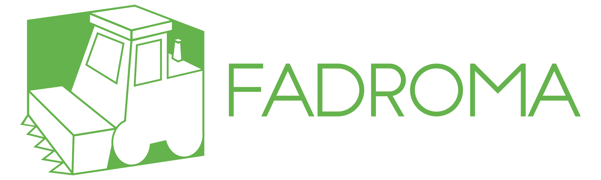

<div align="center">

[](https://fadroma.tech)

Distributed application framework developed at [**Hack.bg**](https://hack.bg).

|Component|Package|Docs|
|-|-|-|
|`fadroma` crate|[](https://crates.io/crates/fadroma)|[](https://docs.rs/fadroma)|
|`fadroma-dsl` crate|[](https://crates.io/crates/fadroma-dsl)|[](https://docs.rs/fadroma-dsl)|
|`@hackbg/fadroma`|[](https://www.npmjs.com/package/@hackbg/fadroma)|[View docs](https://fadroma.tech/ts/modules/_hackbg_fadroma.html)|
|`@fadroma/agent`|[](https://www.npmjs.com/package/@fadroma/agent)|[View docs](https://fadroma.tech/ts/modules/_fadroma_agent.html)|
|`@fadroma/connect`|[](https://www.npmjs.com/package/@fadroma/scrt)|[View docs](https://fadroma.tech/ts/modules/_fadroma_connect.html)|
|`@fadroma/scrt`|[](https://www.npmjs.com/package/@fadroma/connect)|[View docs](https://fadroma.tech/ts/modules/_fadroma_scrt.html)|
|`@fadroma/cw`|[](https://www.npmjs.com/package/@fadroma/connect)|[View docs](https://fadroma.tech/ts/modules/_fadroma_cw.html)|

See [**https://fadroma.tech**](https://fadroma.tech) for overview or try the
[**getting started guide**](https://fadroma.tech/guide.html).

See the [**Fadroma Workshop**](https://github.com/hackbg/fadroma-workshop) repo
for a real-world example, which includes a step-by-step guide on how to build smart
contracts using the Fadroma Rust crate, and the [**Fadroma Factory Example**](https://fadroma.tech/factory.html)
for a guide to deploying your Rust contracts using the Fadroma TypeScript package.

</div>

---

# Getting started

## Create a project

```sh
# Create a project:
$ npx @hackbg/fadroma@latest create

# Create a project using a specific version of Fadroma:
$ npx @hackbg/fadroma@2.0.0 create
```

This will create a new project repository with the required dependencies.

## Build contracts

```sh
# Build all contracts in the project:
$ npm run fadroma build

# Build a single contract:
$ npm run fadroma build some-contract

# Build multiple contracts:
$ npm run fadroma build some-contract another-contract a-third-contract

# Build contract by path:
$ npm run fadroma /path/to/crate
```

By default, builds happen in a Docker container. Set `FADROMA_BUILD_RAW=1` to instead use
your local Rust toolchain.

The production builds of your contracts are stored as `.wasm` binaries in your project's
`wasm/` directory. Every binary has a corresponding `.wasm.sha256` checksum file whose contents
correspond to the on-chain code hash.

To rebuild a contract, do one of the following:
* delete the contract and its checksum from `wasm/`;
* use the `rebuild` command instead of `build`;
* set the `FADROMA_REBUILD=1` when calling `build`, `upload` or `deploy`.

```sh
# Rebuild all contracts:
$ npm run fadroma rebuild
```

## The local devnet

Fadroma allows you to easily run local instances of the supported chains,
in order to test your contracts without uploading them to testnet.

```sh
# Pause the devnet
$ npm run devnet pause

# Export a snapshot of the devnet to a new Docker image
$ npm run devnet export

# Resume the devnet
$ npm run devnet resume

# Stop the devnet and erase all state
$ npm run devnet reset
```

An exported **devnet snapshot** is a great way to provide a standardized dev build
of your project that can be run locally by frontend devs, by your CI pipeline, etc.

## Select target chain

Projects created by Fadroma include define NPM scripts for the supported modes:

```sh
# Deploy to mainnet
$ npm run mainnet deploy

# Deploy to testnet
$ npm run testnet deploy

# Deploy to devnet
$ npm run devnet deploy
```

In the examples below, we will use these interchangeably.

## Upload contracts

```sh
# Build and upload all contracts in the project
$ npm testnet upload

# Build and upload a single contract
$ npm testnet upload some-contract

# Build and upload multiple contracts
$ npm testnet upload some-contract another-contract a-third-contract
```

If contract binaries are not present, the upload command will try to build them first.

Uploading a contract adds an **upload receipt** in `state/$CHAIN_ID/uploads/$CODE_ID.json`.
This prevents duplicate uploads.

To force a reupload, either use the `reupload` command (in place of `upload`), or set
`FADROMA_REUPLOAD=1` (e.g. when invoking `upload` or `deploy`).

```sh
# Reupload all contracts, getting new code ids:
$ npm testnet reupload

# Redeploy with new code ids
$ FADROMA_REUPLOAD=1 npm testnet redeploy
```

## Deploy your project

Use the `deploy` command to deploy your project:

```sh
# Deploy your project to testnet
$ npm run testnet deploy [...ARGS]
```

When deploying, Fadroma will automatically build and upload any contracts that are
specified in the deployment and are not already built or uploaded to the given chain.

Running `deploy` on a completed deployment will do nothing (unless you've updated the
description of the deployment, in which case it will try to apply the updates).
To deploy everything anew, use `redeploy`:

```sh
# Deploy everything anew
$ npm run testnet redeploy [...ARGS]
```

If deploying fails, you should be able to re-run `deploy` and continue where you left off.

## Managing deployments

Deploying a project results in a [deploy receipt](#deploy-receipts) being created -
a simple file containing the state of the deployment. You can have more than one of
these, corresponding to multiple independent deployments of the same code. To see
a list of them, use the `list` command:

```sh
# List deployments in this project
$ npm run testnet list
```

After a deploy, the newly created deployment will be marked as *active*. To switch
to another deployment, use the `select` command:

```sh
# Select another deployment
$ npm run testnet select my-deployment
```

Deployments in YAML multi-document format are human-readable and version control-friendly.
When a list of contracts in JSON is desired, you can use the `export` command to export a JSON
snapshot of the active deployment.

```sh
# Export the state of the active testnet deployment to ./my-deployment_@_timestamp.json
$ npm run testnet export

# Export state to ./some-directory/my-deployment_@_timestamp.json
$ npm run testnet export ./some-directory
```

## Connect to deployment

In a standard Fadroma project, where the Rust contracts
and TypeScript API client live in the same repo, by `export`ing
the latest mainnet and testnet deployments to JSON files
during the TypeScript build process, and adding them to your
API client package, you can publish an up-to-date "address book"
of your project's active contracts as part of your API client library.

```typescript
// TODO
```

Having been deployed once, contracts may be used continously.
The `Deployment`'s `connect` method loads stored data about
the contracts in the deployment, populating the contained
`Contract` instances.

With the above setup you can automatically connect to
your project in mainnet or testnet mode, depending on
what `Agent` you pass:

```typescript
// TODO
```

Or, to connect to individual contracts from the stored deployment:

```typescript
// TODO
```

## Upgrade a deployment

Migrations can be implemented as static or regular methods
of `Deployment` classes.

```typescript
// TODO
```

# Configuration

|Env var|Description|
|-|-|
|**`FADROMA_ARTIFACTS`**            |**Path to directory.** project artifact cache|
|**`FADROMA_BUILD_DOCKERFILE`**     |**Path to a Dockerfile.** dockerfile to build image if missing|
|**`FADROMA_BUILD_IMAGE`**          |**Docker image tag.** image to run|
|**`FADROMA_BUILD_PODMAN`**         |**Boolean.** whether to use podman instead of docker|
|**`FADROMA_BUILD_QUIET`**          |**Boolean.** less log output|
|**`FADROMA_BUILD_RAW`**            |**Boolean.** run the build script in the current environment instead of container|
|**`FADROMA_BUILD_SCRIPT`**         |**Path to script.** build implementation|
|**`FADROMA_BUILD_STATE`**          |**Path to directory.** Checksums of compiled contracts by version (default: `wasm`)|
|**`FADROMA_BUILD_VERBOSE`**        |**Boolean.** more log output|
|**`FADROMA_DEPLOY_STATE`**         |**Path to directory.** Receipts of instantiated (deployed) contracts (default: `state/deployments.csv`)|
|**`FADROMA_DEVNET_CHAIN_ID`**      |**string**: chain ID (set to reconnect to existing devnet)|
|**`FADROMA_DEVNET_HOST`**          |**string**: hostname where the devnet is running|
|**`FADROMA_DEVNET_KEEP_RUNNING`**  |**boolean**: don't pause the container when your script exits|
|**`FADROMA_DEVNET_PLATFORM`**      |**string**: what kind of devnet to instantiate (e.g. `scrt_1.9`)|
|**`FADROMA_DEVNET_PORT`**          |**string**: port on which to connect to the devnet|
|**`FADROMA_DEVNET_REMOVE_ON_EXIT`**|**boolean**: automatically remove the container and state when your script exits|
|**`FADROMA_DOCKER`**               |**Either host:port pair or path to socket.** non-default docker socket address (default: `/var/run/docker.sock`)|
|**`FADROMA_PROJECT`**              |**Path to directory.** root of project|
|**`FADROMA_PROJECT`**              |**Path to script.** Project command entrypoint (default: `ops.ts`)|
|**`FADROMA_REBUILD`**              |**Boolean.** builds always run, artifact cache is ignored|
|**`FADROMA_ROOT`**                 |**Path to directory.** Root directory of project (default: current working directory)|
|**`FADROMA_UPLOAD_STATE`**         |**Path to directory.** Receipts of uploaded contracts (default: `state/uploads.csv`)|

# State

## Deploy receipts

By default, the list of contracts in each deployment created by Fadroma
is stored in `state/${CHAIN_ID}/deploy/${DEPLOYMENT}.yml`.

The deployment currently selected as "active" by the CLI
(usually, the latest created deployment) is symlinked at
`state/${CHAIN_ID}/deploy/.active.yml`.

## Devnet state

Each **devnet** is a stateful local instance of a chain node
(such as `secretd` or `okp4d`), and consists of two things:

1. A container named `fadroma-KIND-ID`, where:

  * `KIND` is what kind of devnet it is. For now, the only valid
    value is `devnet`. In future releases, this will be changed to
    contain the chain name and maybe the chain version.

  * `ID` is a random 8-digit hex number. This way, when you have
    multiple devnets of the same kind, you can distinguish them
    from one another.

  * The name of the container corresponds to the chain ID of the
    contained devnet.

2. State files under `your-project/state/fadroma-KIND-ID/`:

  * `devnet.json` contains metadata about the devnet, such as
    the chain ID, container ID, connection port, and container
    image to use.

  * `wallet/` contains JSON files with the addresses and mnemonics
    of the **genesis accounts** that are created when the devnet
    is initialized. These are the initial holders of the devnet's
    native token, and you can use them to execute transactions.

  * `upload/` and `deploy/` contain **upload and deploy receipts**.
    These work the same as for remote testnets and mainnets,
    and enable reuse of uploads and deployments.
