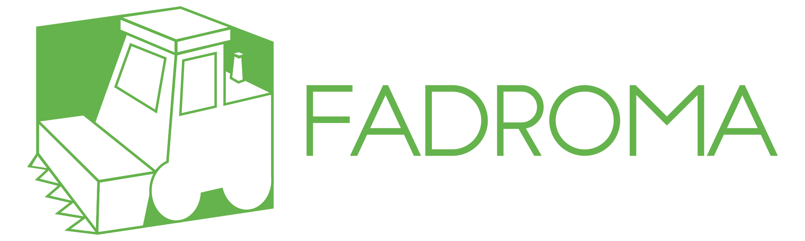

<div align="center">

[](https://fadroma.tech)

---

**[Distributed application groundwork](https://fadroma.tech) developed at
[Hack.bg](https://hack.bg).** Fadroma is a scriptable orchestrator
for building next-generation dApps on CosmWasm-enabled backends.

---

</div>

|Component|Package|Description|
|-|-|-|
|**@hackbg/fadroma**|[](https://www.npmjs.com/package/@hackbg/fadroma)|[**View docs.**](https://fadroma.tech/ts/modules/_hackbg_fadroma.html) Cross-chain connector and deployer.|
|**@fadroma/agent**|[](https://www.npmjs.com/package/@fadroma/agent)|[**View docs.**](https://fadroma.tech/ts/modules/_fadroma_agent.html) Core API model.|
|**@fadroma/scrt**|[](https://www.npmjs.com/package/@fadroma/connect)|[**View docs.**](https://fadroma.tech/ts/modules/_fadroma_scrt.html) Secret Network support.|
|**@fadroma/cw**|[](https://www.npmjs.com/package/@fadroma/connect)|[**View docs.**](https://fadroma.tech/ts/modules/_fadroma_cw.html) Other CosmWasm chain support.|
|**@fadroma/create**|[](https://www.npmjs.com/package/@fadroma/scrt)|[**View docs.**](https://fadroma.tech/ts/modules/_fadroma_create.html) Project setup utility.|
|**@fadroma/compile**|[](https://www.npmjs.com/package/@fadroma/scrt)|[**View docs.**](https://fadroma.tech/ts/modules/_fadroma_compile.html) Smart contact compilation helper.|
|**@fadroma/devnet**|[](https://www.npmjs.com/package/@fadroma/scrt)|[**View docs.**](https://fadroma.tech/ts/modules/_fadroma_devnets.html) Local instances of chains for integration testing.|
|**@fadroma/schema**|[](https://www.npmjs.com/package/@fadroma/scrt)|[**View docs.**](https://fadroma.tech/ts/modules/_fadroma_schema.html) Local instances of chains for integration testing.|
|**fadroma-dsl**|[](https://crates.io/crates/fadroma-dsl)|[](https://docs.rs/fadroma-dsl) Macro-based smart contract DSL.|
|**fadroma**|[](https://crates.io/crates/fadroma)|[](https://docs.rs/fadroma) Library for smart contracts.|

# Getting started

## Creating a project

```sh
# Create a project:
$ npx @hackbg/fadroma@latest create

# Create a project using a specific version of Fadroma:
$ npx @hackbg/fadroma@2.0.0 create
```

The newly created project will contain the following modules:

* **api.ts** is the root module of your project's TypeScript SDK. It contains `Client` subclasses
  that correspond to your contracts, and a `Deployment` subclass which describes how the
  contracts relate to each other. See the [Fadroma Agent API](./agent/README.md) documentation
  for details.

* **config.ts** is your project's deploy configuration. Here, you can customize the
  build/upload/deploy procedures and define project-specific commands that you can then
  access from the Fadroma CLI.

* **test.ts** is where you can write integration tests for your project.

## Building contracts

```sh
# Build all contracts in the project:
$ npm run fadroma build

# Build a single contract:
$ npm run fadroma build some-contract

# Build multiple contracts:
$ npm run fadroma build some-contract another-contract a-third-contract

# Build contract by path:
$ npm run fadroma /path/to/crate
```

By default, builds happen in a Docker container. Set `FADROMA_BUILD_RAW=1` to instead use
your local Rust toolchain.

The production builds of your contracts are stored as `.wasm` binaries in your project's
`wasm/` directory. Every binary has a corresponding `.wasm.sha256` checksum file whose contents
correspond to the on-chain code hash.

To rebuild a contract, do one of the following:
* delete the contract and its checksum from `wasm/`;
* use the `rebuild` command instead of `build`;
* set the `FADROMA_REBUILD=1` when calling `build`, `upload` or `deploy`.

```sh
# Rebuild all contracts:
$ npm run fadroma rebuild
```

## Selecting deploy targets

The supported deploy targets are `mainnet`, `testnet`, and `devnet`. Projects created by Fadroma
define NPM scripts to select them:

```sh
# Deploy to mainnet
$ npm run mainnet deploy

# Deploy to testnet
$ npm run testnet deploy

# Deploy to devnet
$ npm run devnet deploy
```

In the examples below, we will use those interchangeably.

Alternatively, use the `FADROMA_CHAIN` environment variable with `npm run fadroma`.
See [Fadroma Connect](./connect/README.md) for a list of supported values.

## Using the local devnet

Fadroma allows you to easily run local instances of the supported chains,
in order to test your contracts without uploading them to testnet.

```sh
# Pause the devnet
$ npm run devnet pause

# Export a snapshot of the devnet to a new Docker image
$ npm run devnet export

# Resume the devnet
$ npm run devnet resume

# Stop the devnet and erase all state
$ npm run devnet reset
```

An exported **devnet snapshot** is a great way to provide a standardized dev build
of your project that can be run locally by frontend devs, by your CI pipeline, etc.

## Uploading contracts

```sh
# Build and upload all contracts in the project
$ npm testnet upload

# Build and upload a single contract
$ npm testnet upload some-contract

# Build and upload multiple contracts
$ npm testnet upload some-contract another-contract a-third-contract
```

If contract binaries are not present, the upload command will try to build them first.

Uploading a contract adds an **upload receipt** in `state/$CHAIN_ID/uploads/$CODE_ID.json`.
This prevents duplicate uploads.

To force a reupload, either use the `reupload` command (in place of `upload`), or set
`FADROMA_REUPLOAD=1` (e.g. when invoking `upload` or `deploy`).

```sh
# Reupload all contracts, getting new code ids:
$ npm testnet reupload

# Redeploy with new code ids
$ FADROMA_REUPLOAD=1 npm testnet redeploy
```

## Deploying your project

Use the `deploy` command to deploy your project:

```sh
# Deploy your project to testnet
$ npm run testnet deploy [...ARGS]
```

When deploying, Fadroma will automatically build and upload any contracts that are
specified in the deployment and are not already built or uploaded to the given chain.

Running `deploy` on a completed deployment will do nothing (unless you've updated the
description of the deployment, in which case it will try to apply the updates).
To deploy everything anew, use `redeploy`:

```sh
# Deploy everything anew
$ npm run testnet redeploy [...ARGS]
```

If deploying fails, you should be able to re-run `deploy` and continue where you left off.

## Managing deployments

Deploying a project results in a [deploy receipt](#deploy-receipts) being created -
a simple file containing the state of the deployment. You can have more than one of
these, corresponding to multiple independent deployments of the same code. To see
a list of them, use the `list` command:

```sh
# List deployments in this project
$ npm run testnet list
```

After a deploy, the newly created deployment will be marked as *active*. To switch
to another deployment, use the `select` command:

```sh
# Select another deployment
$ npm run testnet select my-deployment
```

Deployments in YAML multi-document format are human-readable and version control-friendly.
When a list of contracts in JSON is desired, you can use the `export` command to export a JSON
snapshot of the active deployment.

```sh
# Export the state of the active testnet deployment to ./my-deployment_@_timestamp.json
$ npm run testnet export

# Export state to ./some-directory/my-deployment_@_timestamp.json
$ npm run testnet export ./some-directory
```

## Connecting to a deployment

In a standard Fadroma project, where the Rust contracts
and TypeScript API client live in the same repo, by `export`ing
the latest mainnet and testnet deployments to JSON files
during the TypeScript build process, and adding them to your
API client package, you can publish an up-to-date "address book"
of your project's active contracts as part of your API client library.

```typescript
// TODO
```

Having been deployed once, contracts may be used continously.
The `Deployment`'s `connect` method loads stored data about
the contracts in the deployment, populating the contained
`Contract` instances.

With the above setup you can automatically connect to
your project in mainnet or testnet mode, depending on
what `Agent` you pass:

```typescript
// TODO
```

Or, to connect to individual contracts from the stored deployment:

```typescript
// TODO
```

## Upgrading a deployment

Migrations can be implemented as static or regular methods
of `Deployment` classes.

```typescript
// TODO
```

## Further reading

* [**Fadroma Agent Core**](./agent/README.md), our core API defining portable user agents
  for smart contract-based backends.
    * [**Fadroma Agent for Secret Network**](./scrt/README.md)
    * [**Fadroma Agent for CosmWasm**](./scrt/README.md)

* [Example: **Fadroma Workshop**](https://github.com/hackbg/fadroma-workshop) repo,
  a step-by-step guide on how to build smart contracts using the Fadroma Rust crate.

* [Example: **Fadroma Factory**](https://fadroma.tech/factory.html),
  a guide to deploying your Rust contracts using the Fadroma TypeScript package,
  via a factory pattern that enables your users to instantiate contracts in a controlled way.

* [**Contribution guidelines**](./CONTRIBUTING.md).

* [**Code of conduct**](./CODE_OF_CONDUCT.md).
