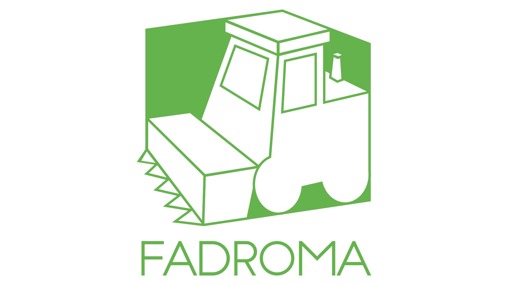

Distributed application framework developed at [**Hack.bg**](https://hack.bg).

|Component|Package|Docs|
|-|-|-|
|`fadroma` crate|||
|`fadroma-dsl` crate|||
|`@hackbg/fadroma`||
|`@fadroma/agent`||
|`@fadroma/ops`||
|`@fadroma/connect`||
|`@fadroma/scrt`||

See [**https://fadroma.tech**](https://fadroma.tech) for overview or try the
[**getting started guide**](./GUIDE.ts.md).

