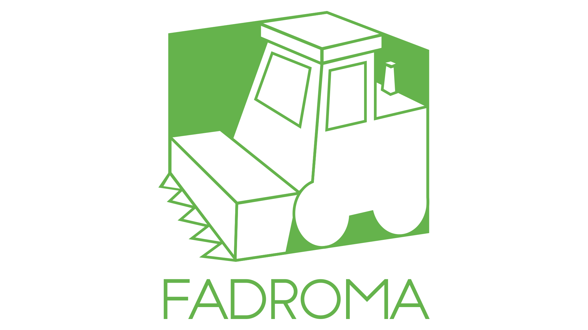

# Overview

[Fadroma](https://fadroma.tech) is a full-stack application framework
for the [CosmWasm](https://cosmwasm.com/) ecosystem.

## To create a new Fadroma project

```sh
npm init @fadroma
```

This will create a new directory with:

  * Repo defaults: `.git`, `.gitignore`, `README.md`, etc.
  * Node.js defaults: `package.json`
    * TypeScript and Literate TypeScript support (@hackbg/ganesha, @hackbg/izomorf)
    * One API client module `api.ts` with default imports and exports.
  * Rust workspace: `Cargo.toml`

## To add a contract to it

The above will result in the initial project state, i.e. empty.

```sh
cd project
npm init @fadroma contract:MyCoin # use CamelCase and Fadroma will translate
```

This will:
  * Add the empty class definition `export class MyCoin extends Client {}` to `api.ts`.
  * Create the `my-coin` subdirectory in the project, containing:
    * `my-coin/README.md`
    * `my-coin/Cargo.toml`
    * `my-coin/my_coin.rs`, importing the library prelude and containing empty API definitions.

> ℹ️  TS class: `CamelCase`, Rust crate: `kebab-case` and Rust module: `snake_case`.

## Exploring

Now you are ready to write your first smart contract, deploy it, and integrate it with
the wider Internet-of-Blockchains. The following guides will show you how:

### The Rust part

[**Fadroma Engine**](https://fadroma.tech/rs/fadroma/index.html) is a collection of
Rust libraries for developing smart contracts.

Fadroma Engine includes [**Fadroma Derive**](https://fadroma.tech/rs/fadroma_proc_derive/index.html),
a collection of procedural macros for cleaner implementation of smart contract internals,
and [**Fadroma Ensemble**](https://fadroma.tech/rs/fadroma/ensemble/index.html), a library
for integration testing of multiple contracts, as well as a range of other useful bits and pieces.

### The TypeScript part

[**Fadroma Client**](https://fadroma.tech/js/modules/_fadroma_client.html) is a library for
interfacing with smart contracts from JavaScript or TypeScript.

Fadroma Client is leveraged by [**Fadroma Ops**](https://fadroma.tech/js/modules/_fadroma_ops.html),
a library for implementing your custom deployment and operations workflow - from local development
to mainnet deployment.

Fadroma Ops includes [**Fadroma Mocknet**](https://fadroma.tech/js/classes/_fadroma_ops.Mocknet.html),
a simulated environment for fast full-stack testing of your production builds.



<div align="center">

*Тука малко като трактор е излязла.*

</div>
